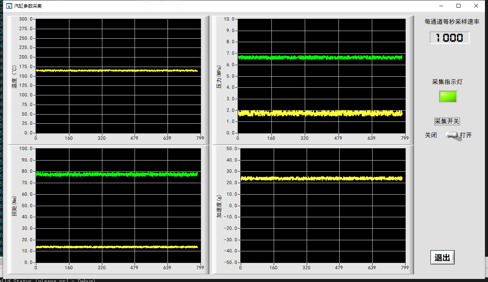
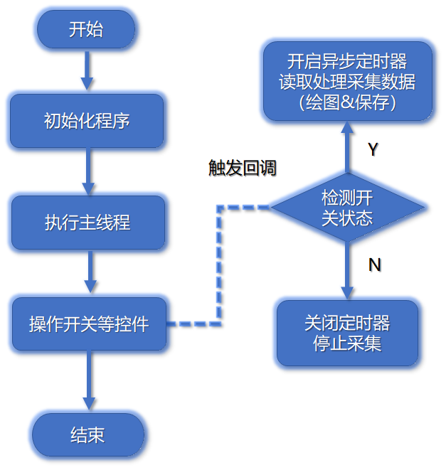
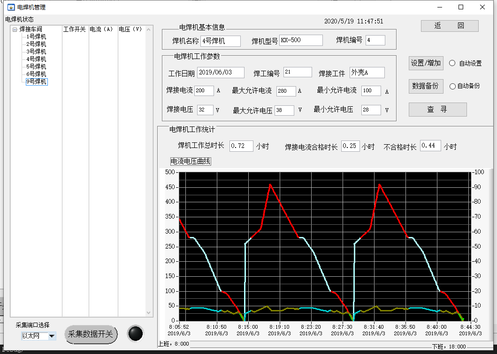
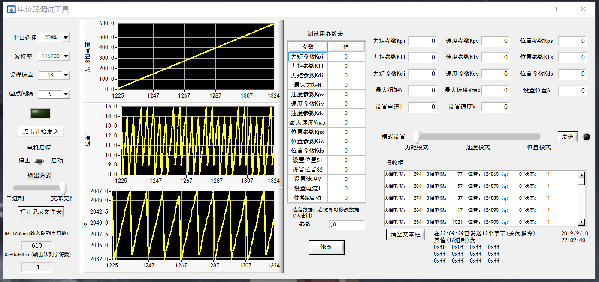
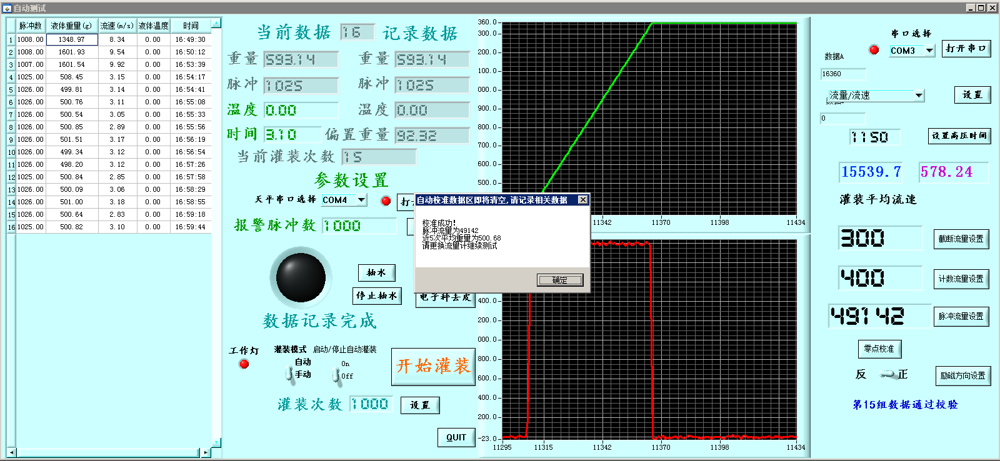

## 目录

以下内容使用 C 语言(ANSI C)编写，在 `LabWindows/CVI `平台下开发。

- 汽缸数据采集上位机部分
- 电焊机数据处理
- 电流环测试工具
- 流量计自动校准

## 一、汽缸数据采集上位机部分

### 1.项目代码

位于文件夹`prj1_cylinder`中，核心文件为`execute.c`、`file.c`、`task.c`分别用于主程序执行、实时数据保存、采集参数调整。

### 2.连接方式

​        采用阿尔泰` USB3202` 数据采集卡，入口端连接温度、压力、扭矩、加速度变送器输出的电压信号，出口端连接电脑的 USB 端。

### 3.软件功能实现

​		软件使用 C 语言(ANSI C)编写，在 `LabWindows/CVI `平台下开发，与采集卡建立连接后可进行实时数据采集、数据绘图和数据保存，下图为实时采集时的软件界面。

		数据采集：经采集卡回传的数据为电压值，经过对应关系折算显示为所测量参数的量纲单位并标注在` Strip Chart` 图表控件上。采样速率默认为每通道每秒 1000 次，并可自定义大小，建议值不超过 10k。
		数据显示：采集到的温度、压力、扭矩、加速度参数分别显示在四个 `Strip Chart `图表控件上。其中压力和扭矩会同时采集两个位置数据点，数据一用黄色线条显示，数据二用绿色线条显示。当采样率不大于 1k 时，每秒绘制 100 点，大于 1k 时每秒绘制 20 点。

​		数据保存：文件存放于软件根目录下 Report 路径中。可指定输出的文本格式为二进制文件或文本文件。每次开始采集都会以”年月日-时分”的形式命名文件并记录数据。当选择二进制文件时，软件会按照温度、压力 1、压力 2、扭矩 1、扭矩 2、加速度的顺序输出双精度浮点型的电压值；当选择文本输出时，按照上述顺序输出精确到小数点后六位的实际值。
​		经测试，当设定采样率为 1000 时，以文本输出时每分钟文件大小约为 6M；以二进制输出时每分钟文件大小约为 2.8M。当改变采样率后，文件大小会以同等比例变化：若将采样率设为2000，每分钟 txt 文件即为 12M，bin 文件为 5.6M。

### 4.软件流程图

​		操作控件会触发对应控件的回调函数，通过回调函数结合控件当前状态执行对应逻辑。如打开采集开关后，采集指示灯点亮，创建以时间为名称的 txt 或 bin 文件，初始化程序（建立设备句柄、设定模拟输入采样参数）并开始模拟输入采样任务，设定异步定时器按指定时间间隔从采集卡接受数据。
​		读取采集数据：将采集到的电压值经过折算整理，显示到对应的 Strip Chart 图表控件上，在新建的文件中按照指定格式进行写入操作。
​		检测开关状态：异步定时器在每次执行前均会判断当前开关状态。开关一直保持打开状态时，将持续进行采集；手动关闭开关后，会立刻释放设备句柄、停止采集任务。

## 二、电焊机数据处理

在原有软件基础上使用`ODBC`连接数据库，SQL语言实现对设备工况记录的增删查改并通过人机交互界面进行可视化操作。下图为查询某焊机工作情况界面，展示数据非真实数据，用于检测电流是否超标和设备是否空置。代码位于`prj2_weldor`中的`queryShow.c`文件中

## 三、电流环测试工具

根据通讯协议向底层设备发送指令并接收回传数据，下图为收发数据时的调试界面。代码详见`prj3_assist`

## 四、流量计自动校准

对某流量计软件增添自动校准功能，实现一键测试。下图为完整流量计校准后的界面。代码位于`prj4_dynamicAdjust`中的`autoSet.c`文件中

